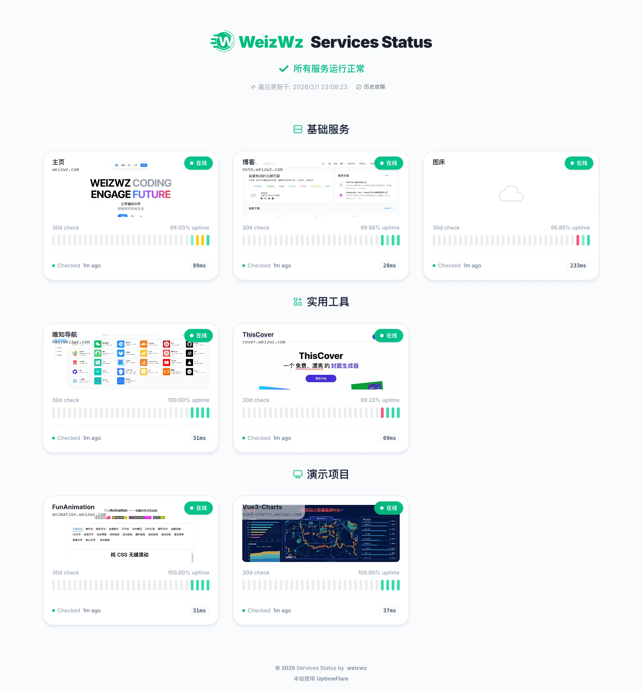

  
  

# ✔[UptimeFlare](https://github.com/weizwz/UptimeFlare)

一个由 Cloudflare Workers 驱动的功能丰富、Serverless 且免费的 Uptime 监控及状态页面。

fork 于 https://github.com/lyc8503/UptimeFlare，进行了界面美化

## ⭐功能

- 开源，易于部署（全程无需本地工具，耗时不到 10 分钟），且完全免费
- 监控功能
  - 最多支持 50 个 1 分钟精度的检查
  - 支持指定全球 [310+ 个城市](https://www.cloudflare.com/network/) 的监控节点
  - 支持 HTTP/HTTPS/TCP 端口监控
  - 最多 90 天的 uptime 历史记录和 uptime 百分比跟踪
  - 可自定义的 HTTP(s) 请求方法、头和主体
  - 可自定义的 HTTP(s) 状态码和关键字检查
  - 支持 [100 多个通知渠道](https://github.com/caronc/apprise/wiki) 的宕机消息通知
  - 可自定义的 Webhook
  - 多语言支持 (中文/英文)
- 状态页面
  - 所有类型监控的交互式 ping（响应时间）图表
  - 计划维护提醒和历史故障页面
  - 响应式 UI，自适应PC/手机屏幕，及亮色/暗色系统主题
  - 配置选项丰富的状态页面
  - 可使用您自己的域名与 CNAME
  - 可选的密码认证（私人状态页面）
  - 用于获取实时状态数据的 JSON API

### 🆕增强功能（Fork）

本 fork 版本新增了以下功能增强：

- **现代化 UI 重新设计** — 使用 Tailwind CSS v4 刷新界面，加入毛玻璃效果和高级视觉设计
- **监控卡片组件** — 独立的监控卡片，一目了然地展示状态、延迟和维护信息
- **页面内自动刷新** — 通过 `/api/status` 接口每 180 秒轮询更新状态数据，无需全页面刷新
- **带 CORS 保护的 Status API** — 安全的 `/api/status` 端点，基于来源的访问控制，防止跨域滥用
- **故障详情弹窗** — 点击 uptime 时间条可查看详细的故障信息，包括持续时间和错误描述
- **历史故障抽屉** — 滑出式抽屉浏览历史故障事件，支持按月份和监控项筛选
- **实时事件展示** — 在事件抽屉中展示实际监控事件，包含持续中/已恢复状态
- **移动端适配** — 优化的响应式布局，适配手机屏幕
- **监控分组** — 重新组织监控分组，优化间距和布局
- **人性化时间显示** — 改进故障时长的时间单位展示
- **自定义站点图标** — 支持自定义 favicon
- **本地开发支持** — 新增本地开发环境配置

## 👀演示

我自己的状态页面（在线演示）：https://status.weizwz.com/

一些截图：

## ⚡快速入门 / 📄文档

请参阅 [Wiki](https://github.com/lyc8503/UptimeFlare/wiki)
